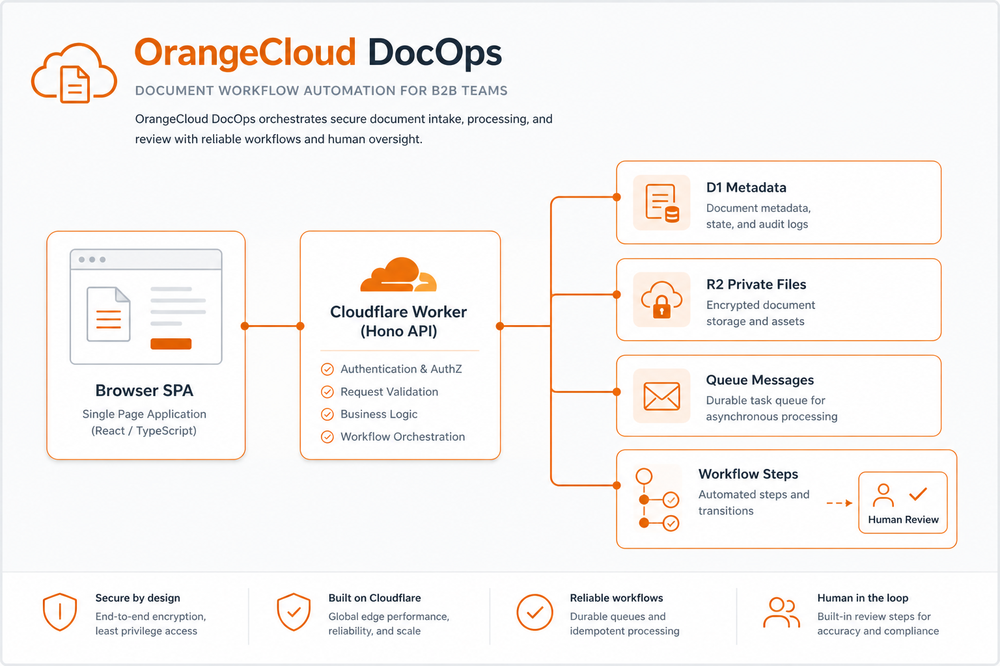

<p align="center">
  
</p>

# OrangeCloud DocOps

Cloudflare-based **Contract-to-Pay** document workflow accelerator for Legal, Procurement, and Accounting.

Bộ tăng tốc quy trình chứng từ **Contract-to-Pay** trên Cloudflare cho Pháp chế, Mua sắm và Kế toán.

| | |
|---|---|
| **Production** | `https://docops.orangecloud.vn` |
| **Staging** | `https://docops-stg.orangecloud.vn` |
| **Package** | `orangecloud-docops` |
| **Phase** | 1 — foundation (ingestion, review, audit, UI) |
| **License** | Proprietary — reference / demo use |

## What this is / Đây là gì

A use-case proof and reference implementation for OrangeCloud presales and solution engineering. It shows how Cloudflare Workers, R2, D1, Queues, and Workflows can operationalize document workflows that connect vendor contracts, purchase orders, and Vietnamese invoices.

Bản chứng minh use-case và triển khai tham chiếu cho presales / solution engineering. Minh họa cách vận hành quy trình chứng từ (hợp đồng, PO, hoá đơn VN) trên Cloudflare mà không thay thế ERP hay CLM.

### What this is not / Không phải là

- Not an ERP or accounting platform / Không phải ERP hay nền tảng kế toán
- Not a tax filing product / Không phải sản phẩm kê khai thuế
- Not a full CLM suite / Không phải bộ CLM đầy đủ
- Not an e-signature provider / Không phải nhà cung cấp chữ ký số
- Not a general-purpose Document AI SaaS / Không phải Document AI SaaS đa năng
- Not a replacement for MISA, SAP, Coupa, Ironclad, Icertis, ABBYY, Rossum, Google Document AI, or Azure Document Intelligence

## Features (Phase 1 / 1.5)

- Same-origin React SPA + Hono API on a single Worker
- Private R2 storage with versioned object keys
- D1 relational schema (org-scoped, multi-tenant ready)
- Queue consumer + durable Workflow (upload → extract → rules → human review)
- Deterministic **Vietnamese invoice XML** field extraction (no invented AI values)
- First Contract-to-Pay rules: arithmetic, duplicates, supplier match, XML/PDF consistency (when peers exist)
- Human review queue with immutable audit events
- Internal ops UI: Dashboard, Documents, Cases (create + list), Review, Rules, Audit, Integrations catalogue
- Product landing page at `/`
- UI i18n: **Tiếng Việt** + **English**
- GitHub Actions CI: typecheck · lint · test · build
- Local seed data under org slug `orangecloud-demo` (synthetic fixtures; binaries not in R2)

## Architecture



```text
Browser (React + i18n)
    │ same origin
    ▼
Cloudflare Worker (Hono /api + SPA assets)
    ├── D1   metadata, cases, reviews, audit, extracted fields, rules
    ├── R2   original document binaries (private)
    ├── Queue  metadata-only processing messages
    └── Workflow  extract → validate → waitForEvent(review)
```

More detail: [docs/ARCHITECTURE.md](docs/ARCHITECTURE.md)

## Tech stack

- TypeScript (strict), React, Vite, Cloudflare Vite plugin
- Hono, React Router, TanStack Query, React Hook Form + Zod, Tailwind CSS
- Workers, R2, D1, Queues, Workflows
- Cloudflare Access (staging/production auth)

## Quick start

```bash
# npm or pnpm
npm install
# pnpm install

cp .dev.vars.example .dev.vars
npm run db:migrate:local
npm run db:seed:local   # optional synthetic data
npm run dev
```

Open `http://localhost:5173/`

- Landing: `/`
- App: `/app/dashboard`
- Language switcher: header (VI / EN)

Local auth is explicit and only active when:

- `ENVIRONMENT=local`
- `LOCAL_DEV_AUTH_ENABLED=true`
- identity from `.dev.vars` (`LOCAL_DEV_AUTH_EMAIL`, `LOCAL_DEV_AUTH_ROLE`)

Never enabled as a silent production fallback.

## Scripts

| Command | Purpose |
|---------|---------|
| `npm run dev` | Local Vite + Worker |
| `npm run build` | Production build |
| `npm run preview` | Preview production build locally |
| `npm run typecheck` | TypeScript check |
| `npm run lint` | ESLint |
| `npm test` | Unit + integration tests |
| `npm run ci` | typecheck + lint + test + build |
| `npm run cf-typegen` | Generate `worker-configuration.d.ts` |
| `npm run db:migrate:local` | Apply D1 migrations locally |
| `npm run db:seed:local` | Synthetic local fixtures only |
| `npm run deploy:staging` | Build + deploy staging |
| `npm run deploy:production` | Build + deploy production (manual) |

## Environment setup

See [docs/SETUP.md](docs/SETUP.md) for:

- Creating D1 / R2 / Queues
- Filling Wrangler binding IDs (never hardcode secrets in git)
- R2 → Queue notifications
- Cloudflare Access secrets
- Custom Domains (`docops.orangecloud.vn`, `docops-stg.orangecloud.vn`)

If your Wrangler login has multiple accounts, set `CLOUDFLARE_ACCOUNT_ID` in your shell for remote commands (do not commit the value).

## Repository layout

```text
src/
  client/     React UI, i18n, landing, feature pages
  worker/     Hono API, domain, D1, R2, queue, workflow
  shared/     Shared domain types
tests/        Unit + integration tests
scripts/      Local seed / smoke helpers
docs/         Setup + architecture
```

## Security notes

- R2 bucket is never public; downloads go through authorized Worker routes
- No password authentication; Access JWT in non-local environments
- Audit events are append-only via the application API
- Queue messages contain identifiers/metadata only — never file bodies
- Do not commit `.dev.vars`, API tokens, or Access secrets

## Phase 2 (planned next)

1. Workers AI extraction baseline for PDF contracts / POs
2. One external extraction-provider adapter
3. Richer field normalization + case amount ceiling / PO / payment-term rules
4. Optional export webhook adapters (ERP / accounting) — thin, not a full ERP

## License

See [LICENSE](LICENSE). Source is published for transparency and OrangeCloud solution engineering reference; contact OrangeCloud before production reuse outside authorized engagements.

## Learn from (related patterns)

Not clones of this product — useful Cloudflare / edge patterns to study:

| Repo | Why look |
|------|----------|
| [cloudflare/workers-sdk](https://github.com/cloudflare/workers-sdk) | Official Wrangler, templates, Workers tooling |
| [honojs/hono](https://github.com/honojs/hono) | API style used here (middleware, routing) |
| [cloudflare/templates](https://github.com/cloudflare/templates) | Vite + Workers, D1, R2 starter shapes |
| [supermemoryai/cloudflare-saas-stack](https://github.com/supermemoryai/cloudflare-saas-stack) | Full Cloudflare SaaS wiring (D1/R2/auth ideas) |
| [ifindev/fullstack-next-cloudflare](https://github.com/ifindev/fullstack-next-cloudflare) | CI/CD + D1/R2 production workflow examples |

Docs first: [Workers](https://developers.cloudflare.com/workers/), [D1](https://developers.cloudflare.com/d1/), [R2](https://developers.cloudflare.com/r2/), [Queues](https://developers.cloudflare.com/queues/), [Workflows](https://developers.cloudflare.com/workflows/), [Access](https://developers.cloudflare.com/cloudflare-one/access-controls/).

## Maintainer

OrangeCloud · Cloudflare solution practice
Trịnh Hoàng Tú